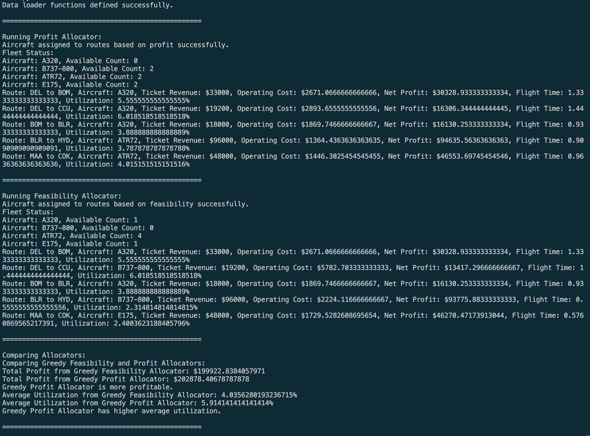

# Airline Fleet Allocation Simulator

A Python-based airline fleet allocation simulator.

## Features

- Fleet allocation under range and capacity constraints
- Feasibility-based allocation algorithm
- Profit-based allocation algorithm
- Revenue, cost, and profit modeling
- Fleet utilization analysis
- Allocation strategy comparison

## Example Output

## Future Work

- Linear Programming optimization
- Scenario analysis
- Network planning
- Demand forecasting